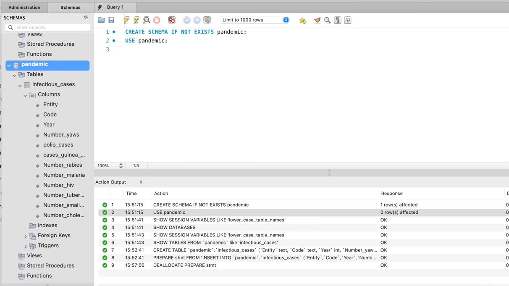
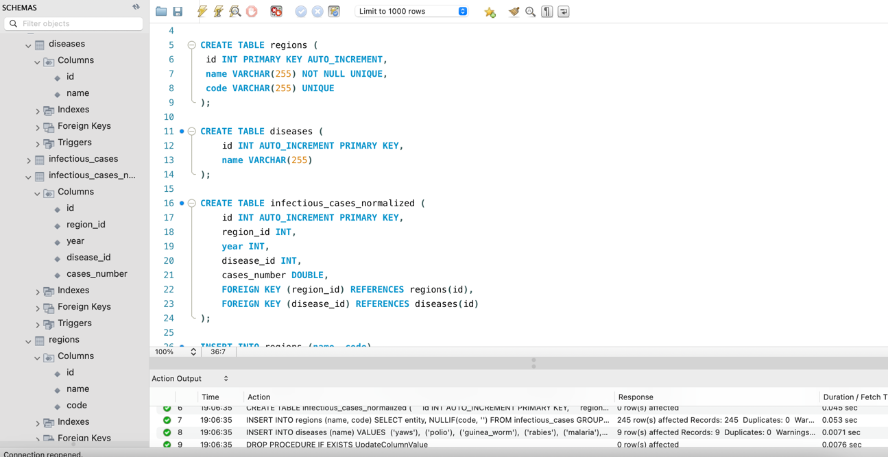
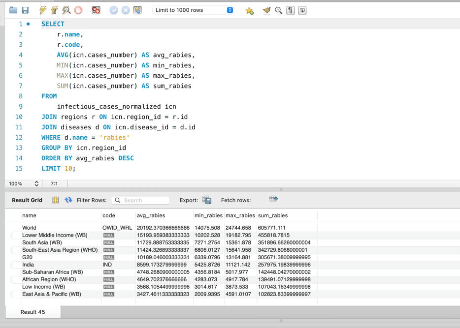
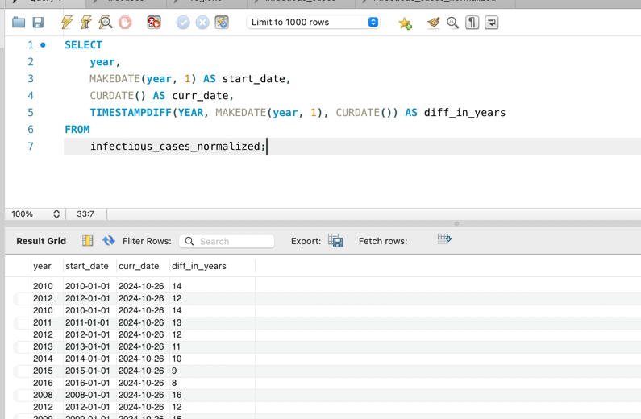
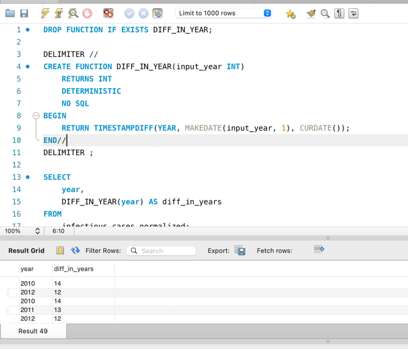

## Опис фінального проєкту та результати виконання

1. Завантажте дані:

- Створіть схему pandemic у базі даних за допомогою SQL-команди.
- Оберіть її як схему за замовчуванням за допомогою SQL-команди.
- Імпортуйте [**дані**](https://drive.google.com/file/d/1lHEXJvu2omYRgvSek6mHq-iQ3RmGAQ7e/view) за допомогою Import wizard так, як ви вже робили це у темі 3.
- Продивіться дані, щоб бути у контексті.


```mysql-sql
CREATE SCHEMA IF NOT EXISTS pandemic;

USE pandemic;
```

Схема після імпорту
```mysql-sql
CREATE TABLE `infectious_cases` (
    `Entity` text,
    `Code` text,
    `Year` int DEFAULT NULL,
    `Number_yaws` text,
    `polio_cases` text,
    `cases_guinea_worm` text,
    `Number_rabies` text,
    `Number_malaria` text,
    `Number_hiv` text,
    `Number_tuberculosis` text,
    `Number_smallpox` text,
    `Number_cholera_cases` text
) ENGINE=InnoDB DEFAULT CHARSET=utf8mb4 COLLATE=utf8mb4_0900_ai_ci
```




2. Нормалізуйте таблицю infectious_cases. Збережіть у цій же схемі дві таблиці з нормалізованими даними.

```mysql-sql
DROP TABLE IF EXISTS infectious_cases_normalized;
DROP TABLE IF EXISTS regions;
DROP TABLE IF EXISTS diseases;

CREATE TABLE regions (
 id INT PRIMARY KEY AUTO_INCREMENT,
 name VARCHAR(255) NOT NULL UNIQUE,
 code VARCHAR(255) UNIQUE
);

CREATE TABLE diseases (
    id INT AUTO_INCREMENT PRIMARY KEY,
    name VARCHAR(255)
);

CREATE TABLE infectious_cases_normalized (
    id INT AUTO_INCREMENT PRIMARY KEY,
    region_id INT,
    year INT,
    disease_id INT,
    cases_number DOUBLE,
    FOREIGN KEY (region_id) REFERENCES regions(id),
    FOREIGN KEY (disease_id) REFERENCES diseases(id)
);

INSERT INTO regions (name, code)
SELECT entity, NULLIF(code, '') FROM infectious_cases GROUP BY entity, code;

INSERT INTO diseases (name)
VALUES
	('yaws'),
	('polio'),
	('guinea_worm'),
	('rabies'),
	('malaria'),
	('hiv'),
	('tuberculosis'),
	('smallpox'),
	('cholera');

DROP PROCEDURE IF EXISTS UpdateColumnValue;

DELIMITER //

CREATE PROCEDURE UpdateColumnValue (
    diseaseName VARCHAR(64),
    diseaseColumnName VARCHAR(64)
)
BEGIN
    -- Змінна для зберігання динамічного SQL-запиту
    SET @sql = CONCAT(
            'INSERT INTO infectious_cases_normalized (region_id, year, disease_id, cases_number) ',
            'SELECT r.id region_id, ic.year, d.id disease_id, ic.' , diseaseColumnName, ' ',
            'FROM infectious_cases ic ',
            'JOIN diseases d ON d.name = \'', diseaseName , '\' ',
            'JOIN regions r ON ic.Entity = r.name ',
            'WHERE ic.' , diseaseColumnName ,' != \'\''
               );

    -- Підготовка запиту
    PREPARE stmt FROM @sql;

    -- Виконання запиту з переданими аргументами
    EXECUTE stmt;

    -- Завершення підготовленого запиту
    DEALLOCATE PREPARE stmt;
END //

DELIMITER ;

CALL UpdateColumnValue('yaws', 'Number_yaws');
CALL UpdateColumnValue('polio', 'polio_cases');
CALL UpdateColumnValue('guinea_worm', 'cases_guinea_worm');
CALL UpdateColumnValue('rabies', 'Number_rabies');
CALL UpdateColumnValue('malaria', 'Number_malaria');
CALL UpdateColumnValue('hiv', 'Number_hiv');
CALL UpdateColumnValue('tuberculosis', 'Number_tuberculosis');
CALL UpdateColumnValue('smallpox', 'Number_smallpox');
CALL UpdateColumnValue('cholera', 'Number_cholera_cases');
```
   


3. Проаналізуйте дані:

- Для кожної унікальної комбінації Entity та Code або їх id порахуйте середнє, мінімальне, максимальне значення та суму для атрибута Number_rabies.

> [!TIP]
> Врахуйте, що атрибут Number_rabies може містити порожні значення ‘’ — вам попередньо необхідно їх відфільтрувати.

- Результат відсортуйте за порахованим середнім значенням у порядку спадання.
- Оберіть тільки 10 рядків для виведення на екран.

```mysql-sql
SELECT
    r.name,
    r.code,
    AVG(icn.cases_number) AS avg_rabies,
    MIN(icn.cases_number) AS min_rabies,
    MAX(icn.cases_number) AS max_rabies,
    SUM(icn.cases_number) AS sum_rabies
FROM
    infectious_cases_normalized icn
        JOIN
    regions r ON icn.region_id = r.id
        JOIN
    diseases d ON icn.disease_id = d.id
WHERE
    d.name = 'rabies'
GROUP BY
    icn.region_id
ORDER BY
    avg_rabies DESC
LIMIT
    10;
```
  


4. Побудуйте колонку різниці в роках.

Для оригінальної або нормованої таблиці для колонки Year побудуйте з використанням вбудованих SQL-функцій:

- атрибут, що створює дату першого січня відповідного року,

> [!TIP]
> Наприклад, якщо атрибут містить значення ’1996’, то значення нового атрибута має бути ‘1996-01-01’.

- атрибут, що дорівнює поточній даті,
- атрибут, що дорівнює різниці в роках двох вищезгаданих колонок.

> [!TIP]
> Перераховувати всі інші атрибути, такі як Number_malaria, не потрібно.

👉🏼 Для пошуку необхідних вбудованих функцій вам може знадобитися матеріал до теми 7.

```mysql-sql
SELECT
    year,
    MAKEDATE(year, 1) AS start_date,
    CURDATE() AS curr_date,
    TIMESTAMPDIFF(YEAR, MAKEDATE(year, 1), CURDATE()) AS diff_in_years
FROM
    infectious_cases_normalized;

```


5. Побудуйте власну функцію.

- Створіть і використайте функцію, що будує такий же атрибут, як і в попередньому завданні: функція має приймати на вхід значення року, а повертати різницю в роках між поточною датою та датою, створеною з атрибута року (1996 рік → ‘1996-01-01’).

> [!TIP]
> Якщо ви не виконали попереднє завдання, то можете побудувати іншу функцію — функцію, що рахує кількість захворювань за певний період. Для цього треба поділити кількість захворювань на рік на певне число: 12 — для отримання середньої кількості захворювань на місяць, 4 — на квартал або 2 — на півріччя. Таким чином, функція буде приймати два параметри: кількість захворювань на рік та довільний дільник. Ви також маєте використати її — запустити на даних. Оскільки не всі рядки містять число захворювань, вам необхідно буде відсіяти ті, що не мають чисельного значення (≠ ‘’).

```mysql-sql
DROP FUNCTION IF EXISTS DIFF_IN_YEAR;

DELIMITER //
CREATE FUNCTION DIFF_IN_YEAR(input_year INT)
    RETURNS INT
    DETERMINISTIC
    NO SQL
BEGIN
    RETURN TIMESTAMPDIFF(YEAR, MAKEDATE(input_year, 1), CURDATE());
END//

DELIMITER ;

SELECT
    year,
    MAKEDATE(year, 1) AS start_date,
    CURDATE() AS curr_date,
    DIFF_IN_YEAR(year) AS diff_in_years
FROM
    infectious_cases_normalized;
```


